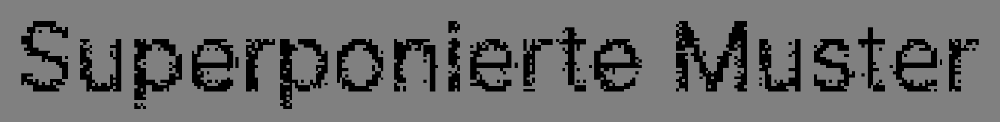
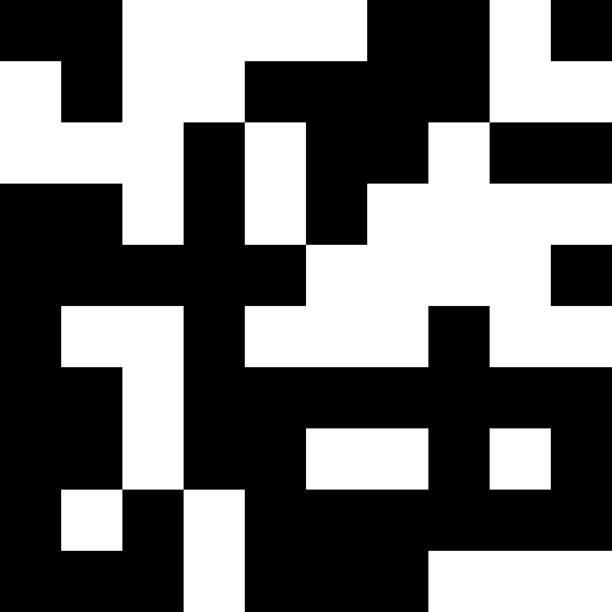
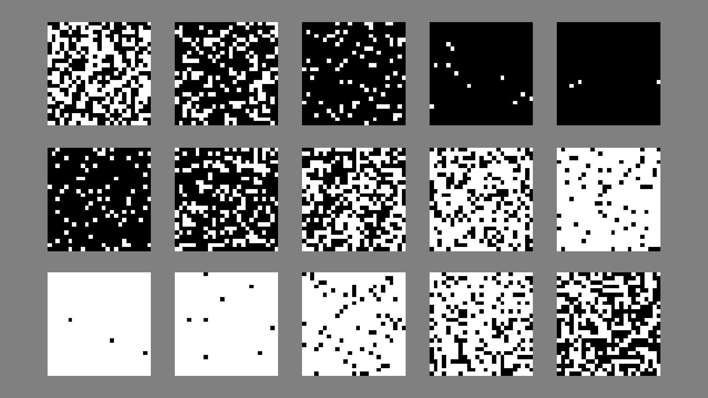
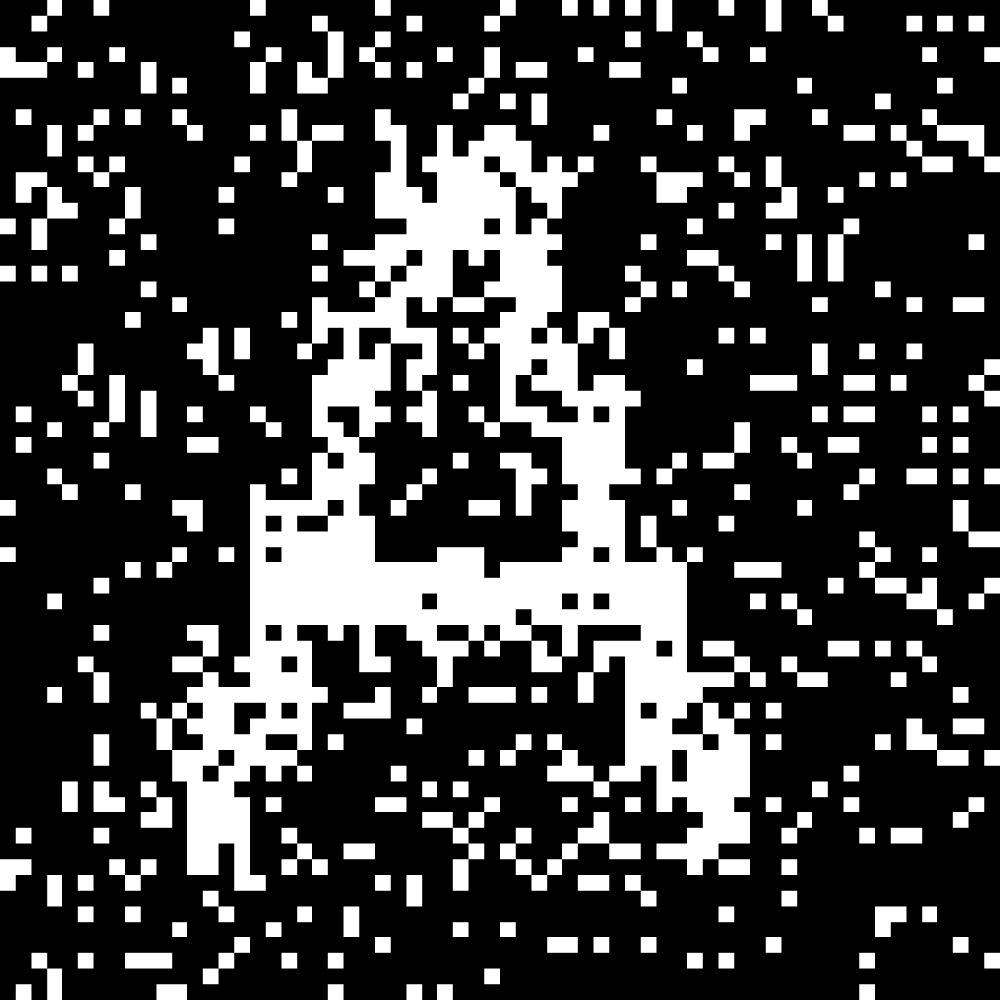
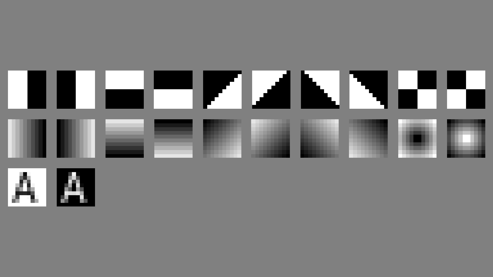
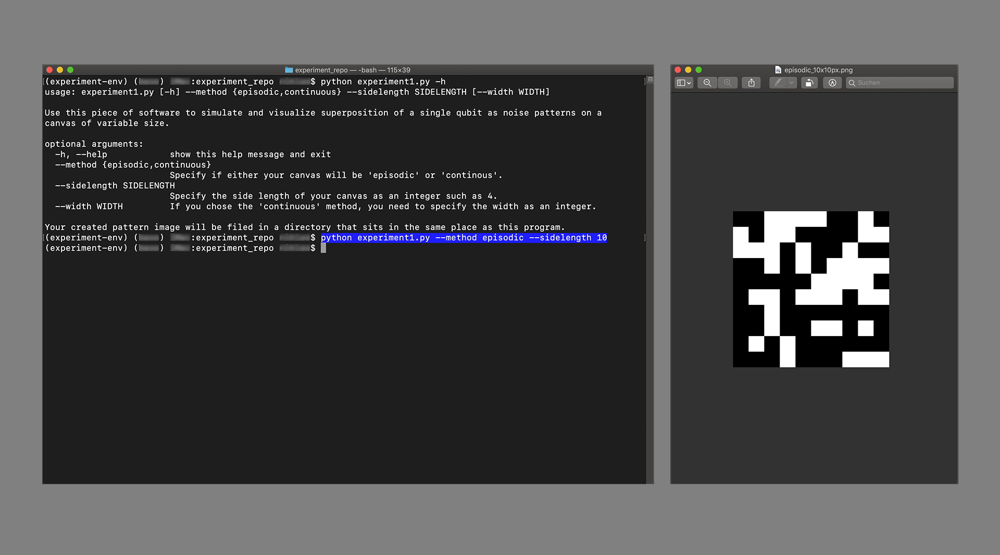

# Anleitung für Experimente 1 - 3

## Voraussetzungen

Für die Verwendung dieser Software wird die Installation von **Python (Version 3.6 oder höher)** vorausgesetzt. Weitere Informationen über die Installation für Dein System: https://www.python.org/downloads/.
Alle Skripte wurden unter **macOS 10.14.**, **Linux Ubuntu 20.04 LTS** und **Windows 10** getestet.

## Überblick

```
experiment_repo
└ README.md
└ experiment1.py
└ experiment2.py
└ experiment3.py
└ generate_sample_img.py
└ install_venv_requirements.sh
└ install_venv_requirements.bat
└ requirements.txt
└ Inter-Regular.ttf
└ example_outputs
└ IPYNB
	└ experiment1_v2.ipynb
	└ experiment2_v2.ipynb
	└ experiment3_v2.ipynb
	└ generate_sample_img_v2.ipynb
```

1.	Experimente 1 - 3

	`└ experiment1.py`

	Dieses Skript simuliert und visualisiert die Superposition *eines* Qubits als Rauschmuster auf einem Bild mit wählbarer Größe.

	```bash
	python experiment1.py --method METHOD --sidelength SIDELENGTH --width WIDTH
	```
	
	|Eingabeargument|Beschreibung|
	|:---|:---|
	|`--method {episodic,continuous}`|Methode der Darstellung, episodisch `episodic` (quadratisches `sidelength` x `sidelength`) oder kontinuierlich `continuous` (`sidelength` x `width`)|					
	|`--sidelength SIDELENGTH`|Seitenhöhe `sidelength` der Bildgröße, z. B. `10`| 
	|`--width WIDTH`|Bei `continuous` *kann* die Bildbreite `width` gewählt werden, z. B. `100`|
	
	Beispiel Eingabe:
	```bash
	python experiment1.py --method episodic --sidelength 10
	```

	Beispiel Output:
	
	
			
	`└ experiment2.py`

	Dieses Skript simuliert, visualiziert und verschiebt die Superposition *eines* Qubits als Rauschmuster auf einem quadratischen Bild mit wählbarer Größe.

	```bash
	python experiment2.py --method METHOD --phase PHASE --samples SAMPLES --sidelength SIDELENGTH
	```

	|Eingabeargument|Beschreibung|
	|:---|:---|
	|`--method {episodic,range}`|Methode `episodic` für einzelne Bilder, `range` für eine Reihe an Bildern|
	|`--phase PHASE`|Phase, die das Verhältnis von Schwarz und Weiß im `episodic` Rauschmuster bestimmt|
	|`--samples SAMPLES`|Anzahl der Bildern in der Reihe bei `range`, z. B. `15`|					
	|`--sidelength SIDELENGTH`|Seitenhöhe `sidelength` der Bildgröße, z. B. `25`|
	
	Beispiel Eingabe:
	```bash
	python experiment2.py --method range --samples 15 --sidelength 25
	```

	Beispiel Output:
	
	

	`└ experiment3.py`

	Dieses Skript verarbeitet Rasterbilder, indem es die Superposition einzelner Qubits simuliert und anhand Farbpixelwerten eines quadratischen Bildes visualisiert, anstatt mit manuell definierten Phasen.

	```bash
	python experiment3.py --input INPUT --resolution RESOLUTION --channel CHANNEL --method METHOD
	```

	|Eingabeargument|Beschreibung|
	|:---|:---|
	|`--input`|Absoluter Pfad des **quadratischen** Originalbildes|
	|`--resolution RESOLUTION`|Auflösung, mit welcher jedes Pixel gerendert werden soll, z. B. `4`|
	|`--channel CHANNEL`|Bei Farbbildern *kann* zwischen `r`, `g` *oder* `b` gewählt werden|					
	|`--method {serial,parallel}`|Methode der Berechnung, seriell `serial` oder `parallel`|
	
	Beispiel Eingabe:
	```bash
	python experiment3.py --input /Pfad/zum/Rasterbild.png --resolution 4 --method serial
	```

	Beispiel Output:
	
	

2.	Testbildgenerator
	
	`└ generate_sample_img.py`

	Diese Skript dient zur automatisierten Erstellung von Testbildern für `experiment3.py`.

	```bash
	python generate_sample_img.py --sidelength SIDELENGTH
	```

	|Eingabeargument|Beschreibung|
	|:---|:---|
	|`--sidelength SIDELENGTH`|Seitenhöhe `sidelength` der Bildgröße, z. B. `10`| 

	Beispiel Eingabe:
	```bash
	python generate_sample_img.py --sidelength 10
	```

	Beispiel Ausgabe:
	
	

3.	Installationdateien
	
	`└ install_venv_requirements.sh` - installiert eine virtuelle Umgebung und Softwarepakete für **macOS** oder **Linux**.

	`└ install_venv_requirements.bat` - installiert eine virtuelle Umgebung und Softwarepakete für ** Windows**.

	`└ requirements.txt` - Auflistung aller benötigten Softwarepakete

4.	Weiteres
	
	`└ Inter-Regular.ttf` - Schrift für alphanumerische Testbilder aus `generate_sample_img.py`
	
	`└ example_outputs` - Beispielresultate aus `experiment1.py`, `experiment2.py` und `experiment3.py`
	
	`└ IPYNB` - Skripte in Form von Jupyter Notebooks (Enthalten in der [Anaconda](https://www.anaconda.com/) Distribution) für Anpassungen weiteres Experimentieren

## Installation



Die Installationsdatei erstellt eine sogenannte [Virtual Environment](https://docs.python.org/3/tutorial/venv.html) `experiment-env` und installiert in `requirements.txt` benötigte Softwarepackete automatisch (Internetverbindung wird benötigt).
Die Umgebung ist **nur** zur Ausführung der Experimente gedacht und verändert sonst *nichts* auf Deinem Computer. Das heißt, Du kannst den Ordner nach belieben löschen und musst Dich nicht um Fragmente kümmern.
Wie Du den Installationsbefehl ausführst hängt von Deinem System ab. Es gibt verschiedene Installationsdateien für verschiedene Betriebssysteme:

**Hinweis**: Für eine erfolgreiche Ausführung und Installation ist es wichtig, dass Du dich *im* `experiment_repo` befindest!

-	**macOS oder Linux**\
	**Terminal**\
	`install_venv_requirements.sh`

	1.	Zum Ort wechseln, wo das `experiment_repo` liegt
	
		```bash
		cd /Pfad/zu/experiment_repo/
		```
	
	2.	Ausführen des Installationskriptes	
	
		```bash
		source install_venv_requirements.sh
		```
	
	3.	Nach der Installation ist `experiment-env` *aktiv*
	
		`(experiment-env)(...) ...:experiment_repo ...$ ...`
		
		Um `experiment-env` zu deaktivieren:

		```bash
		deactivate
		```

		Um `experiment-env` manuell zu aktivieren:

		```bash
		source experiment-env/bin/activate
		```

		Die Experimente können nur ausgeführt werden, wenn `experiment-env` *aktiv* ist!

	4.	Auführung eines Experiments, z. B. `experiment1.py`:

		```bash
		python experiment1.py --method episodic --sidelength 10
		``` 
		Alle Skript-Erzeugnisse werden in einem separaten Ordner (z. B. `experiment1_output`) in `experiment_repo` ausgegeben (vorausgesetzt s. **Hinweis** oben).

-	**Windows**\
	**Eingabeaufforderung**\
	`install_venv_requirements.bat`

	1.	Zum Ort wechseln, wo das `experiment_repo` liegt
	
		```bat
		cd \Pfad\zu\experiment_repo\
		```

	2.	Ausführen des Installationskriptes	
	
		```bat
		install_venv_requirements.bat
		```
	
	3.	Nach der Installation ist `experiment-env` *aktiv*
	
		`(experiment-env) C:\Pfad\zu\experiment_repo>`
		
		Um `experiment-env` zu deaktivieren:

		```bat
		deactivate
		```

		Um `experiment-env` manuell zu aktivieren:

		```bat
		.\experiment-env\Scripts\activate
		```

		Die Experimente können nur ausgeführt werden, wenn `experiment-env` *aktiv* ist!

	4.	Auführung eines Experiments, z. B. `experiment2.py`:

		```bat
		python experiment2.py --method range --samples 25 --sidelength 50
		``` 
		Alle Skript-Erzeugnisse werden in einem separaten Ordner (z. B. `experiment2_output`) in `experiment_repo` ausgegeben (vorausgesetzt s. **Hinweis** oben).
